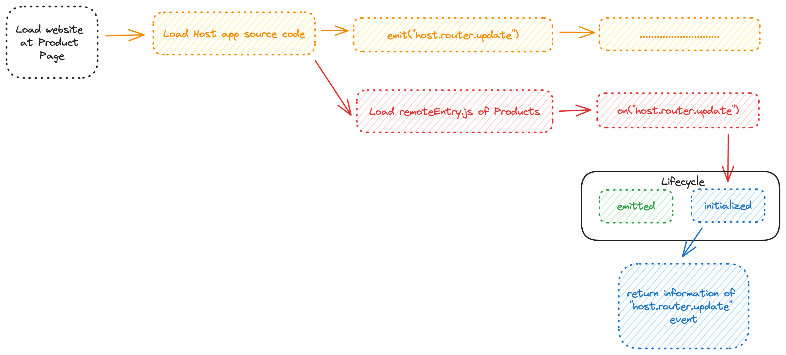

# Nano Event Bus

This is a simple and tiny event emitter library for JavaScript/Typescript, motivate from this library [nano-events](https://github.com/ai/nanoevents).
This library have a mechanism to listen event lately, it means an event is emitted before to mainly support for **Micro Frontend** projects.

```typescript
  const user = {
    id: '1',
    name: 'John'
  }

  emit('user.update', user);

  on('user.update-user', 'client.user.update-user', (event) => {
    console.log(event)
  }, true);
  // => { lifecycle: 'initialized', value: { id: '1', name: 'John' } }
```

**Micro Frontend example**

Overcoming difficulties in event listening between remote and host apps due to the delayed loading of the remoteEntry file.

Consider the scenario where the host loads first, and subsequent Products remote apps load later. The host immediately triggers an event host.router.update meant for a Product app that is still in the loading process, the Product app may fail to capture the event.

Solution: To mitigate this, a mechanism has been developed to store emitted events and re-emit them once the remote app successfully loads. At this time, Product app still get information of event host.router.update from host app at initialize lifecycle state, and continue to handle next step.

[Micro Frontend Repository](https://github.com/lequochung19971/micro-fe-react)

## Table of Content

- [Nano Event Bus](#nano-event-bus)
  - [Table of Content](#table-of-content)
  - [Install](#install)
  - [Usages](#usages)
    - [Create Event Bus](#create-event-bus)
    - [Add Listener](#add-listener)
    - [Listen emitted event late](#listen-emitted-event-late)
    - [Remove listeners and events](#remove-listeners-and-events)

## Install

```
npm install nano-event-bus-ts
```

## Usages 

### Create Event Bus

```typescript
const eventBus = createNanoEventBus()
```

### Add Listener

Use on method to add listener for specific event:

```typescript
eventBus.on('test', 'listener', (event) => {
  // Do something
});

eventBus.emit('do-something', { test: 10 });
```

Different with other libraries, when using `on` method to listen event, have to define `listenerName`, it will use `listenerName` to cache handler and some other information instead of using reference value of `handler` method like other libs.

### Listen emitted event late

Pass `true` value for `isLateListening` param of `on` method

```typescript
eventBus.emit('do-something', { test: 10 });

eventBus.on('test', 'listener', (event) => {
  console.log(event) //  => { lifecycle: 'initialized', value: { id: '1', name: 'John' } }
}, true);
```

When applying late listening to the emitted event, the first listening will have the lifecycle is `initialized`, the next one will be `emitted`.

When not applying late listening, this lifecycle is always `emitted`.

### Remove listeners and events

```typescript
const removeListener = eventBus.on('test', 'listener', (event) => {
  // Do something
});
removeListener();

const removeEvent = eventBus.emit('do-something', { test: 10 });
removeEvent();
```
